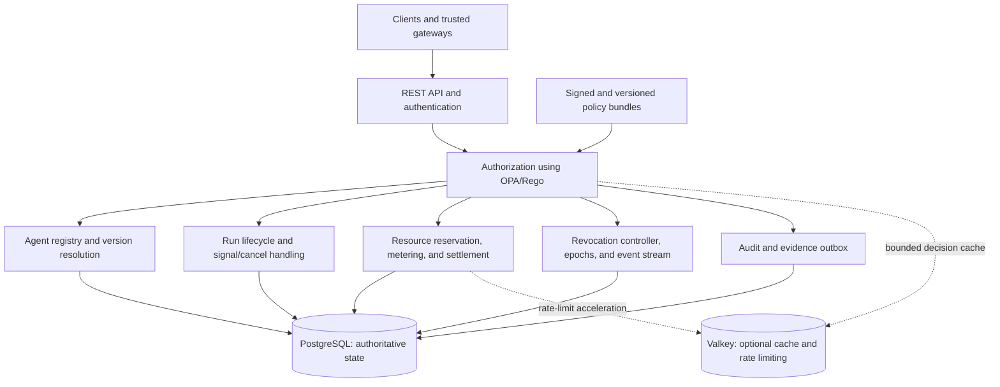

# ThinkPixelAG

ThinkPixelAG is an agent governance and lifecycle control plane for Kubernetes. It registers approved agents, authenticates callers, authorizes operations with policy, creates and governs runs, allocates resource envelopes, distributes revocations, and emits evidence suitable for audit and incident response.

The project implements the governance-plane concepts in the Enterprise Execution Platform for AI Agents blueprint. It is a control plane, not an agent harness: workers execute agent logic, while ThinkPixelAG owns durable decisions and state that must survive worker failure.

## Status

The engineering foundation, authoritative PostgreSQL persistence, and Phase 3
identity, policy, and registry work are complete. Phase 3 provides OIDC
authentication plus a fail-closed OPA policy boundary, signed bundle activation
lifecycle, and baseline Rego.
The policy boundary includes adversarial golden tests and an optional
integrity-protected, epoch/version-bound Valkey decision cache.
The agent registry now provides validated tenant-scoped creation, optimistic
metadata/lifecycle updates, and list/describe application and persistence
boundaries. Agent implementations are registered as immutable canonical
schema-v1 manifests with verified content/image digests, bounded declarations
and limits, and database-enforced artifact immutability. Version approval,
rejection, deprecation, and revocation use an authorized append-only lifecycle
whose decision, audit record, and outbox event commit atomically. Policy-driven
resolution selects approved versions server-side, requires privileged policy
evidence for historical pins or deprecated rollback, and persists immutable
per-run evidence snapshots. The public agent list and description endpoints
authenticate opaque cursors, filter every active/invocable agent through policy,
and return enumeration-safe detail errors.
Phase 0 contracts and the Phase 1, Phase 2, and Phase 3 implementations have
passed their exit gates. [PLAN.md](PLAN.md) defines the
target architecture and delivery phases; [TODO.md](TODO.md) is the ordered,
atomic release-candidate checklist. Phase evidence is indexed in
[docs/README.md](docs/README.md).

The normative architecture, security, domain, policy, API, and operational contracts are indexed in [docs/README.md](docs/README.md). The initial OpenAPI 3.1 description is at [api/openapi/thinkpixelag.yaml](api/openapi/thinkpixelag.yaml).

## Goals

- Make agents registered, owned, risk-classified, versioned services rather than anonymous processes.
- Expose a stable, harness-independent REST API for agent discovery and run lifecycle operations.
- Resolve approved agent implementations server-side and prevent callers from selecting unapproved versions.
- Enforce tenant isolation, caller authorization, agent/tool/model/skill allowlists, and execution constraints.
- Reserve, meter, settle, and reclaim consumable resources transactionally.
- Enforce structural limits and deadlines without allowing a harness to expand its own envelope.
- Revoke runs, agents, versions, skills, principals, tenants, tools, and policy versions with bounded propagation staleness.
- Publish immutable audit evidence and operational telemetry for security and reliability teams.
- Run as a hardened, horizontally scalable Kubernetes workload.

## Non-goals for the first release candidate

- Executing model or tool calls inside the governance service.
- Providing an agent SDK or general-purpose workflow engine.
- Cross-organization identity federation or delegation.
- Building a full web administration console.
- Implementing MCP or A2A adapters; the canonical REST API will leave explicit extension points for them.
- Owning enterprise identity, key management, billing, or the independent evidence sink.

## Proposed architecture

The first release is a modular Go service with one deployable API process and a separately runnable migration command. Internal module boundaries preserve a future path to split high-scale or high-trust functions into services without accepting distributed-system complexity prematurely.



### Technology choices

- **Go:** API, domain logic, background workers, migrations tooling, and command-line entry points.
- **PostgreSQL:** authoritative persistence for agents and versions, policy metadata, runs and events, resource ledgers and reservations, revocations and epochs, idempotency records, and the transactional outbox. PostgreSQL transactions and row-level locking/conditional updates are required for allocation invariants.
- **OPA/Rego:** policy decisions. Rego source and bundles are versioned and promoted as controlled artifacts. PostgreSQL stores policy metadata and active-version references; an object/OCI artifact store may hold signed bundles once deployment requirements justify it. The service must never silently fall back to a stale policy after its allowed validity window.
- **Valkey:** optional, disposable acceleration for bounded decision caches, distributed rate limits, and ephemeral coordination. Correctness and authoritative security state must not depend on Valkey. The service remains functional, with reduced performance, when it is unavailable.
- **Kubernetes:** deployment, health probes, configuration, workload identity, secret references, disruption controls, and horizontal scaling.
- **OCI image:** a non-root, minimal, reproducible image built by the Makefile and CI.

### Trust boundaries

Caller identity and tenant context come only from a verified access token and trusted identity configuration. Tenant identity, delegation tokens, policy decisions, usage reports, or resource extensions supplied in ordinary request bodies are not trusted. High-risk writes require current authoritative revocation state. Privileged changes require stronger authorization, separation-of-duty integration points, and independent evidence emission.

## API contract and implemented Phase 4 surface

The versioned API begins with:

```http
GET  /v1/agents
GET  /v1/agents/{agent_id}
POST /v1/agents/{agent_id}/runs
GET  /v1/runs/{run_id}
POST /v1/runs/{run_id}/signals
POST /v1/runs/{run_id}/cancel
GET  /v1/runs/{run_id}/events
```

Run event consumption is an authenticated, tenant-scoped SSE stream. Events
are emitted in database sequence order with HMAC-authenticated, run-bound IDs;
clients resume with `Last-Event-ID` (or `after`). Idle connections receive
comment heartbeats, slow clients are bounded by per-write deadlines, and a
cursor older than the configured 10,000-event logical retention window returns
`410 Gone` so the client can refetch authoritative run state.

Administrative APIs for agent/version registration, policy promotion, revocation, resource extensions, and trusted metering will be isolated by authorization policy and documented in OpenAPI. Mutation endpoints use idempotency keys and optimistic or transactional concurrency controls.

Authorized resource extensions are additive, approval-referenced ledger actions. They can add consumable capacity or move an existing deadline forward without rewriting the original grant, and a run requester cannot extend its own run even if it also holds an administrative role.

Phase 3 implements authenticated public agent list/description handlers and the
governed version-approval handler, plus application and PostgreSQL boundaries
for agent/version registration, approval state, discovery, and version
resolution. Phase 4 implements the run-admission application and PostgreSQL
transaction and public admission endpoint: authenticated identity, policy-narrowed constraints, version
eligibility, the admitted run, resolution snapshot, envelope header, first
event, audit record, and outbox record commit as one unit. `POST
/v1/agents/{agent_id}/runs` enforces bounded strict JSON, a scoped
`Idempotency-Key`, server-derived tenant/principal identity, controlled explicit
version selection, and stable replay/conflict responses. `GET /v1/runs/{run_id}` returns the
tenant-scoped lifecycle and envelope summary only after `runs.read`
authorization; malformed, absent, cross-tenant, and policy-hidden identifiers
all produce the same enumeration-safe not-found response. `POST
/v1/runs/{run_id}/signals` accepts only typed, bounded `PAUSE`, `RESUME`, and
`CUSTOM` commands after `runs.signal` authorization. It supports optional state
version preconditions and scoped idempotent replay, and atomically records the
signal, ordered run event, audit evidence, and at-least-once outbox delivery.
`POST /v1/runs/{run_id}/cancel` is separately authorized by `runs.cancel`,
supports scoped idempotency and an optional state-version precondition, and
serializes with terminal transitions. A winning cancellation atomically fences
workers and records its command, ordered event, audit, and outbox evidence;
when completion, failure, or timeout wins first, the established terminal
projection is returned without being overwritten.

The trusted worker application boundary can claim tenant-scoped admitted or
recoverable running work, heartbeat a bounded lease, and start, complete, fail,
or time out the run. Every claim gets a new opaque lease ID and monotonically
increasing fencing token. PostgreSQL compares the unexpired lease and fence
while holding the run lock, so a worker delayed beyond expiry cannot heartbeat
or mutate after another worker reclaims the run. Every successful claim,
heartbeat, start, completion, failure, and timeout atomically emits an ordered
run event and outbox envelope. The shared event/message UUID is the sink
deduplication key, so a publisher crash after delivery but before acknowledgement
causes a safe at-least-once replay of the same identity.
See the [run lifecycle API examples](docs/api/run-lifecycle.md), the canonical
[state-machine contract](docs/contracts/domain-model.md#run-lifecycle), and the
[Phase 4 evidence](docs/phase-4-evidence.md) for the exact qualified surface and
security behavior.

## Run and resource model

Runs follow an explicit state machine. Terminal transitions are idempotent. Budget exhaustion is a lifecycle state, not merely an alert. Each admitted run receives an immutable-at-issuance resource envelope containing:

- consumables such as USD budget, model tokens, tool calls, CPU seconds, and egress bytes;
- structural ceilings such as rate, active/total children, and delegation depth;
- a deadline that only an authorized governance action can extend.

Child reservations are atomically debited from parent availability. Trusted usage is recorded in an append-only ledger. Terminal settlement closes the reservation exactly once and immediately returns unused capacity to the parent in the same database transaction.

The trusted settlement endpoint requires a terminal child state, authoritative
`resources.settle` policy approval, and an actor-scoped idempotency key. It
derives consumption from the child's durable balances rather than a caller
summary, rejects settlement while descendant allocations remain open, and
returns an identical established result under repeated or concurrent delivery.

A tenant-scoped reconciliation worker repairs terminal reservations left open
after a crash and reservations whose governed expiry has passed. Replicas claim
eligible rows with PostgreSQL `SKIP LOCKED`; an expired live child is fenced and
timed out before its authoritative unused balance is returned. Each candidate
commits independently with immutable settlement, audit, run-event (when timed
out), and outbox evidence. The unique reservation settlement boundary makes a
lost response or concurrent retry unable to credit the parent twice. Open
descendant allocations remain held for a later leaf-first reconciliation pass.

Child admission now composes the authorized run aggregate, parent link,
structural checks, consumable reservation, and evidence in one PostgreSQL
transaction. A parent-envelope lock serializes sibling admissions: open
reservations define active children, all reservations define lifetime children,
and authoritative envelope ancestry defines delegation depth. Child structural
grants must narrow or equal the parent's immutable grants. Consumable balance
locks remain ordered by dimension UUID, and any structural or quantity conflict
rolls back the complete child admission.

Trusted metering is exposed at `POST /v1/trusted/runs/{run_id}/usage`. The
verified principal must match `producer_id` and receive an explicit
`resources.meter` policy allow. Producer/source event keys are serialized and
globally unique within the tenant: identical retries return the original
receipt, while changed reuse conflicts. Accepted nonnegative consumable usage
is appended and atomically transferred from availability to direct consumption;
unit mismatches, overflow, over-budget usage, disabled producers, and usage
after settlement fail closed.

Metered consumables may have a structural `<resource>_per_minute` companion
grant (for example, `tool_calls_per_minute`). The server applies each accepted
event to a PostgreSQL-backed UTC minute window in the same transaction as its
usage ledger and balance mutation. Concurrent events cannot cross the grant.
An optional integrity-protected Valkey marker can reject an already exhausted
window sooner; cache misses, corruption, or outages bypass to PostgreSQL and
never create an allow. Identical source-event retries remain replayable even
when the accelerator reports that the window is blocked.

Metering is accepted only while the authoritative run state is `RUNNING`. When
an accepted event makes any consumable balance exactly zero, that same
PostgreSQL transaction records `BUDGET_EXHAUSTED`, invalidates the worker lease,
and applies the policy-selected disposition. The baseline policy pauses
low/medium-risk runs for the governed extension workflow and terminates
high/critical-risk runs as `FAILED_BUDGET`; missing disposition advice fails
conservatively. Both lifecycle steps, their ordered events, audit evidence, and
outbox messages commit with the usage ledger and balance update. Exact usage
replays still return their original receipt after the state changes.

## Security and reliability principles

- Deny by default and fail closed when required policy or revocation freshness cannot be established.
- Keep credentials short-lived; use Kubernetes workload identity and managed KMS/HSM-backed keys in production.
- Separate governance signing roles and administrative privileges by compromise domain.
- Sign and version promoted policies and configuration.
- Emit privileged-action evidence through a transactional outbox to an independently administered sink.
- Avoid sensitive payloads, tokens, and raw agent inputs in logs, metrics, traces, or policy decision records.
- Make every mutation idempotent and every asynchronous consumer replay-safe.
- Define readiness from actual dependencies and security freshness rather than process liveness alone.

## Repository layout

```text
cmd/                 API server and migration entry points (implementations pending)
internal/            domain, application, ports, and adapter package boundaries
api/openapi/         OpenAPI contract
policies/            Rego packages, data schemas, and policy tests
migrations/          PostgreSQL schema migrations
deploy/              Kubernetes manifests or Helm chart
docs/adr/            durable architecture decision records
test/                 integration, contract, security, and end-to-end tests
tools/                isolated, exactly pinned development and security tools
Dockerfile            production OCI image
Makefile              build, lint, test, policy, image, and local-dev targets
```

## Development workflow

The repository-root Makefile is the stable local and CI interface:

```sh
make tools
make generate
make fmt
make lint
make test
make test-integration
make test-policy
make test-e2e
make build
make image
make verify
```

`make test-integration`, `make test-e2e`, and `make verify` require PostgreSQL. By default they
use the loopback-only development database started by `make dev-up`; set
`TEST_DATABASE_URL` to use another disposable PostgreSQL database. Integration
and end-to-end tests use disposable data and must never target production.

Start the pinned local dependencies with `make dev-up` (PostgreSQL and OPA), or
`make dev-up-valkey` to include the optional cache. Use `make dev-smoke` to check
versions and authentication, `make dev-down` to preserve database state, and
`make dev-reset` to delete only this Compose project's local volumes. See the
[local dependency stack](deploy/README.md) for credentials and port overrides.

`make verify` is the aggregate non-runtime release gate and must match CI.
GitHub Actions runs the same Make targets as isolated, read-only jobs for
quality, unit/race/policy/integration tests, security checks, binary build, and
the OCI-image build and hardened runtime smoke test. `make image` builds the
pinned multi-stage distroless image; `make container-smoke` proves its non-root,
read-only, probe, metadata, and graceful-shutdown behavior. See
[development and verification commands](docs/operations/development.md).

Dependency sources, licenses, vulnerability handling, exceptions, and pinned
build tools follow the [dependency and build-tool policy](docs/security/dependencies.md).

Runtime logs are structured JSON with context-derived request/trace correlation
and centralized sensitive-field redaction. The operational contract and safe-use
rules are documented in [structured logging and redaction](docs/operations/logging.md).

Prometheus metrics use a private registry with bounded labels. OpenTelemetry
tracing supports no-op and local/production OTLP-over-HTTP modes with explicit
flush and shutdown ownership. See [metrics and tracing](docs/operations/observability.md).

The runnable `cmd/thinkpixelag` process provides bounded HTTP serving,
correlated access logs and traces, RFC 7807 failures, graceful signal-driven
shutdown, and unauthenticated `/livez`, `/readyz`, and `/metrics` operational
endpoints. See [HTTP server and process lifecycle](docs/operations/http-server.md).

## Configuration and deployment

Configuration uses strict typed defaults, `THINKPIXELAG_*` environment variables,
and non-secret flags, and is validated before startup. Secret-bearing database,
Valkey, and OPA credentials are environment-only and redact under normal and JSON
formatting. See the [configuration reference](docs/configuration.md) for precedence,
settings, and validation rules. Secrets are referenced through Kubernetes and
never committed. Production deployment must use TLS at ingress, authenticated
service-to-service traffic, NetworkPolicies, non-root containers, a read-only
root filesystem, resource limits, PodDisruptionBudget, anti-affinity/topology
spreading, and a migration job executed before rollout.

## Release-candidate definition

The project reaches release-candidate state when the canonical API and administrative workflows are implemented, security and concurrency invariants have automated tests, PostgreSQL backup/restore and migration behavior are exercised, the image and Kubernetes artifacts pass security checks, operational dashboards/runbooks exist, and all ordered items in [TODO.md](TODO.md) are complete. At that point, durable decisions and implementation history are moved into `docs/adr/`, `PLAN.md` and `TODO.md` are removed, and the resulting documentation change is committed.

## License

Licensed under the terms in [LICENSE](LICENSE).
