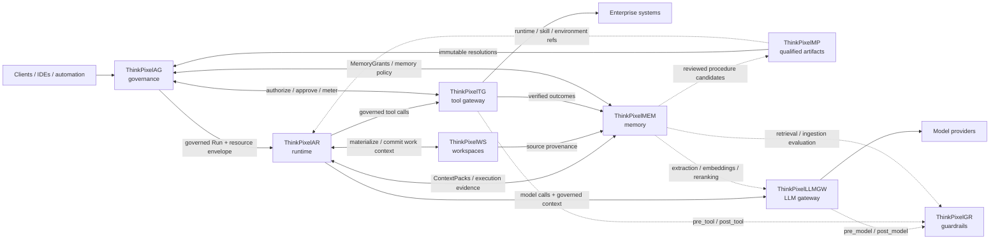

# ThinkPixelAG

ThinkPixelAG is the agent governance and lifecycle control plane for the modular
ThinkPixel platform. It owns durable agent and Run authority: registration,
admission, policy decisions, resource envelopes, approvals, revocation, and
governance evidence. It does not execute agent logic or broker model and tool
credentials.

The service is independently deployable. Integrations with other ThinkPixel
components use replaceable adapters and versioned contracts; they are not
in-process dependencies. See [ALIGNMENT.md](ALIGNMENT.md) for the repository's
ownership and integration boundaries.

## Status

Phases 0 through 6 are implemented and verified. The repository includes the
engineering foundation, PostgreSQL persistence, OIDC authentication, fail-closed
OPA policy evaluation, the immutable agent registry, governed Run lifecycle,
authoritative resource accounting, and bounded revocation distribution and
freshness.

Governance self-protection, production operations, and release-candidate closure
remain in progress. [TODO.md](TODO.md) is the ordered execution ledger, and
[PLAN.md](PLAN.md) records current implementation intent. Completed-phase
evidence is indexed in the [design documentation](docs/README.md).

## Quick start

Prerequisites and supported versions are documented in
[docs/supported-versions.md](docs/supported-versions.md).

```sh
make tools
make dev-up
make dev-smoke
make test
make test-integration
make test-policy
make build
```

Use `make dev-up-valkey` to include the optional cache. `make verify` is the
aggregate developer and CI gate; it also requires the documented container
tooling. See [development and verification](docs/operations/development.md) for
the complete workflow and safe test-database requirements.

## Key concepts

- Verified identity and policy establish authority; request content, Skills,
  Workspace membership, memory, model output, and guardrail results cannot
  enlarge it.
- PostgreSQL is authoritative. Valkey is an optional, disposable accelerator
  and cannot create an allow, advance an epoch, or expand a balance.
- Agent versions are immutable, content-addressed artifacts with separate
  approval and revocation state.
- Run admission persists a governed version resolution and resource envelope;
  untrusted runtimes may enforce or narrow that authority but cannot expand it.
- Resource reservation, metering, settlement, and reclaim preserve capacity
  transactionally and emit correlated governance evidence.
- Revocation decisions are ordered, resumable, epoch-bound, and subject to
  operation-specific freshness limits.

## Documentation

- [Design documentation index](docs/README.md)
- [OpenAPI 3.1 contract](api/openapi/thinkpixelag.yaml)
- [System architecture](docs/architecture/system.md)
- [Domain and lifecycle contracts](docs/contracts/domain-model.md)
- [Resource accounting contract](docs/contracts/resource-accounting.md)
- [Revocation and freshness contract](docs/contracts/revocation.md)
- [Threat model](docs/security/threat-model.md)
- [Configuration reference](docs/configuration.md)
- [Deployment guidance](deploy/README.md)

## Repository layout

```text
api/          public API schemas
cmd/          service and migration commands
internal/     domain, application, ports, and adapters
migrations/   PostgreSQL migrations
policies/     Rego policy and tests
deploy/       deployment assets and guidance
docs/         durable architecture, contracts, security, and operations docs
test/         integration, contract, security, and end-to-end tests
```

## ThinkPixel platform

This project is part of the **ThinkPixel** family: a modular, vendor-neutral set of components for building governed enterprise AI-agent platforms.

Each component is independently useful. The complete platform is a composition of replaceable services connected through versioned contracts; no component requires the full stack in order to be deployed.

| Component | Role |
|---|---|
| [ThinkPixelAG](https://github.com/bdobrica/ThinkPixelAG) | Agent governance and lifecycle control plane: agent/run authority, policy decisions, resource envelopes, approvals, revocation, and trusted governance state. |
| [ThinkPixelAR](https://github.com/bdobrica/ThinkPixelAR) | Agent runtime: durable Sessions, isolated/disposable execution, harness adaptation, recovery, and runtime events. |
| [ThinkPixelWS](https://github.com/bdobrica/ThinkPixelWS) | Durable roaming Workspaces: persistent work context, immutable generations, materializations, snapshots, forks, and source provenance. |
| [ThinkPixelMEM](https://github.com/bdobrica/ThinkPixelMEM) | Long-term agent memory: governed learned context, provenance, temporal revisions, retrieval, correction, and forgetting. |
| [ThinkPixelMP](https://github.com/bdobrica/ThinkPixelMP) | Marketplace and software supply-chain plane for Skills, runtimes, MCP servers, agent bundles, and other immutable agentic artifacts. |
| [ThinkPixelTG](https://github.com/bdobrica/ThinkPixelTG) | Tool gateway and policy-enforcement point for governed tool calls, downstream credentials, side effects, idempotency, and tool evidence. |
| [ThinkPixelLLMGW](https://github.com/bdobrica/ThinkPixelLLMGW) | LLM gateway for provider abstraction, model routing, credentials, budgets, accounting, and model-access policy enforcement. |
| [ThinkPixelGR](https://github.com/bdobrica/ThinkPixelGR) | Guardrails evaluator for model, tool, retrieval, and ingestion content. It returns findings/decisions; the calling gateway or service enforces them. |

### Intended composition



The diagram describes the **target integration model**, not a claim that every edge is implemented in every current release.

### Integration rules

The platform follows a few cross-component rules:

- **Authority does not emerge from content.** Marketplace metadata, Skills, Workspace membership, retrieved memory, model output, or a guardrail `allow` decision cannot grant permissions that the governed Run does not already have.
- **State has one authoritative owner.** Components exchange references and versioned messages; they do not read or write another component's database directly.
- **Integrations are adapters, not domain dependencies.** A ThinkPixel integration should be configurable and replaceable with a contract-compatible alternative.
- **Cross-component identity is explicit.** Where relevant, requests should carry stable governed context such as tenant, principal, agent, Run, Session/Workspace references, immutable artifact digests, and trace context.
- **Public integration contracts are versioned.** OpenAPI/JSON Schema/protobuf or another explicit wire contract is preferred over importing another repository's internal types.
- **Vendor-specific behavior stays behind adapters.** Model providers, agent harnesses, storage systems, registries, policy engines, and execution substrates must not become platform-wide domain contracts.

### Planned integration points

| Integration | Intended contract |
|---|---|
| **AG → AR** | AG admits a Run and supplies its authority/resource context; AR executes it and must not enlarge that authority. Revocation, lease, and fencing state flow back into runtime enforcement. |
| **MP → AG / AR / WS** | MP resolves qualified artifacts to immutable identities/digests. AG decides whether they may be used; AR/WS consume the resolved runtime, Skill, or environment references. Qualification is not authorization. |
| **AR ↔ WS** | AR materializes a durable Workspace generation into disposable execution and returns committed/checkpointed work to WS. Session identity remains owned by AR; Workspace identity remains owned by WS. |
| **AR → LLMGW** | Agent model calls go through LLMGW with governed Run/tenant context. Provider credentials and provider-specific routing stay outside the harness. |
| **LLMGW ↔ GR** | LLMGW will support an optional configured GR endpoint/profile mapping. It invokes `pre_model` before provider dispatch and `post_model` before releasing model output, then enforces GR's decision/transformation. GR remains optional and replaceable; its wire API is the contract. |
| **AR → TG** | Harness tool calls cross TG rather than reaching governed enterprise systems directly. TG owns credential brokerage, idempotency/side-effect handling, and trusted tool evidence. |
| **TG ↔ AG** | TG asks AG (or a contract-compatible authorizer) whether the current governed Run may perform the exact operation and obtains action-scoped approval when required. TG returns trusted metering/evidence. |
| **TG ↔ GR** | TG invokes `pre_tool` and `post_tool` evaluation when configured and enforces the result. A GR allow never overrides an AG authorization denial. |
| **AR / WS / TG → MEM** | Execution history, Workspace provenance, and verified tool outcomes may become evidence for learned memory. MEM does not become the source of truth for those upstream systems. |
| **AG ↔ MEM** | AG supplies Run-scoped memory authority (for example MemoryGrants); MEM enforces it for reads/writes and returns structured ContextPacks. |
| **MEM ↔ LLMGW / GR** | MEM may use LLMGW for extraction/embedding/reranking and GR for ingestion/retrieval inspection while keeping canonical memory state independent from either service. |
| **MEM → MP** | Learned procedure candidates may be reviewed and promoted through MP into qualified reusable Skills; learning does not silently become trusted executable behavior. |

Project-specific implementation status, supported versions, and release qualification belong in each project's own documentation.

## License

Licensed under the terms in [LICENSE](LICENSE).
