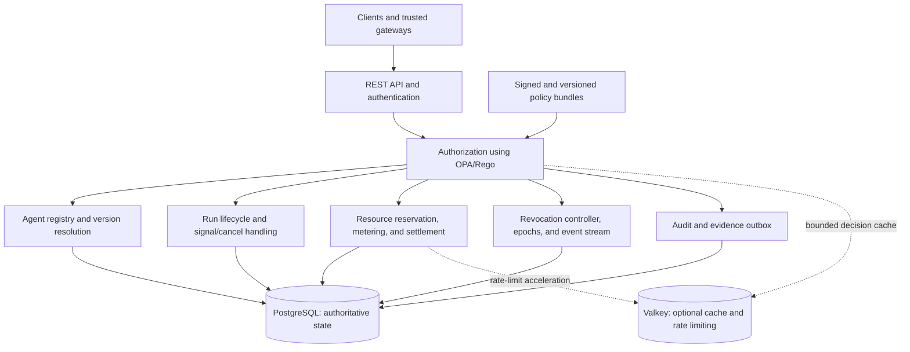

# ThinkPixelAG

ThinkPixelAG is an agent governance and lifecycle control plane for Kubernetes. It registers approved agents, authenticates callers, authorizes operations with policy, creates and governs runs, allocates resource envelopes, distributes revocations, and emits evidence suitable for audit and incident response.

The project implements the governance-plane concepts in the Enterprise Execution Platform for AI Agents blueprint. It is a control plane, not an agent harness: workers execute agent logic, while ThinkPixelAG owns durable decisions and state that must survive worker failure.

## Status

The project is in the engineering-foundation phase. Phase 0 contracts and the initial Go module/package boundaries are complete. [PLAN.md](PLAN.md) defines the target architecture and delivery phases; [TODO.md](TODO.md) is the ordered, atomic release-candidate checklist.

The normative architecture, security, domain, policy, API, and operational contracts are indexed in [docs/README.md](docs/README.md). The initial OpenAPI 3.1 description is at [api/openapi/thinkpixelag.yaml](api/openapi/thinkpixelag.yaml).

## Goals

- Make agents registered, owned, risk-classified, versioned services rather than anonymous processes.
- Expose a stable, harness-independent REST API for agent discovery and run lifecycle operations.
- Resolve approved agent implementations server-side and prevent callers from selecting unapproved versions.
- Enforce tenant isolation, caller authorization, agent/tool/model/skill allowlists, and execution constraints.
- Reserve, meter, settle, and reclaim consumable resources transactionally.
- Enforce structural limits and deadlines without allowing a harness to expand its own envelope.
- Revoke runs, agents, versions, skills, principals, tenants, tools, and policy versions with bounded propagation staleness.
- Publish immutable audit evidence and operational telemetry for security and reliability teams.
- Run as a hardened, horizontally scalable Kubernetes workload.

## Non-goals for the first release candidate

- Executing model or tool calls inside the governance service.
- Providing an agent SDK or general-purpose workflow engine.
- Cross-organization identity federation or delegation.
- Building a full web administration console.
- Implementing MCP or A2A adapters; the canonical REST API will leave explicit extension points for them.
- Owning enterprise identity, key management, billing, or the independent evidence sink.

## Proposed architecture

The first release is a modular Go service with one deployable API process and a separately runnable migration command. Internal module boundaries preserve a future path to split high-scale or high-trust functions into services without accepting distributed-system complexity prematurely.



### Technology choices

- **Go:** API, domain logic, background workers, migrations tooling, and command-line entry points.
- **PostgreSQL:** authoritative persistence for agents and versions, policy metadata, runs and events, resource ledgers and reservations, revocations and epochs, idempotency records, and the transactional outbox. PostgreSQL transactions and row-level locking/conditional updates are required for allocation invariants.
- **OPA/Rego:** policy decisions. Rego source and bundles are versioned and promoted as controlled artifacts. PostgreSQL stores policy metadata and active-version references; an object/OCI artifact store may hold signed bundles once deployment requirements justify it. The service must never silently fall back to a stale policy after its allowed validity window.
- **Valkey:** optional, disposable acceleration for bounded decision caches, distributed rate limits, and ephemeral coordination. Correctness and authoritative security state must not depend on Valkey. The service remains functional, with reduced performance, when it is unavailable.
- **Kubernetes:** deployment, health probes, configuration, workload identity, secret references, disruption controls, and horizontal scaling.
- **OCI image:** a non-root, minimal, reproducible image built by the Makefile and CI.

### Trust boundaries

Caller identity and tenant context come only from a verified access token and trusted identity configuration. Tenant identity, delegation tokens, policy decisions, usage reports, or resource extensions supplied in ordinary request bodies are not trusted. High-risk writes require current authoritative revocation state. Privileged changes require stronger authorization, separation-of-duty integration points, and independent evidence emission.

## Planned API

The versioned API begins with:

```http
GET  /v1/agents
GET  /v1/agents/{agent_id}
POST /v1/agents/{agent_id}/runs
GET  /v1/runs/{run_id}
POST /v1/runs/{run_id}/signals
POST /v1/runs/{run_id}/cancel
GET  /v1/runs/{run_id}/events
```

Administrative APIs for agent/version registration, policy promotion, revocation, resource extensions, and trusted metering will be isolated by authorization policy and documented in OpenAPI. Mutation endpoints use idempotency keys and optimistic or transactional concurrency controls.

## Run and resource model

Runs follow an explicit state machine. Terminal transitions are idempotent. Budget exhaustion is a lifecycle state, not merely an alert. Each admitted run receives an immutable-at-issuance resource envelope containing:

- consumables such as USD budget, model tokens, tool calls, CPU seconds, and egress bytes;
- structural ceilings such as rate, active/total children, and delegation depth;
- a deadline that only an authorized governance action can extend.

Child reservations are atomically debited from parent availability. Trusted usage is recorded in an append-only ledger. Terminal settlement closes the reservation exactly once and immediately returns unused capacity to the parent in the same database transaction.

## Security and reliability principles

- Deny by default and fail closed when required policy or revocation freshness cannot be established.
- Keep credentials short-lived; use Kubernetes workload identity and managed KMS/HSM-backed keys in production.
- Separate governance signing roles and administrative privileges by compromise domain.
- Sign and version promoted policies and configuration.
- Emit privileged-action evidence through a transactional outbox to an independently administered sink.
- Avoid sensitive payloads, tokens, and raw agent inputs in logs, metrics, traces, or policy decision records.
- Make every mutation idempotent and every asynchronous consumer replay-safe.
- Define readiness from actual dependencies and security freshness rather than process liveness alone.

## Repository layout

```text
cmd/                 API server and migration entry points (implementations pending)
internal/            domain, application, ports, and adapter package boundaries
api/openapi/         OpenAPI contract
policies/            Rego packages, data schemas, and policy tests
migrations/          PostgreSQL schema migrations
deploy/              Kubernetes manifests or Helm chart
docs/adr/            durable architecture decision records
test/                 integration, contract, security, and end-to-end tests
tools/                isolated, exactly pinned development and security tools
Dockerfile            production OCI image
Makefile              build, lint, test, policy, image, and local-dev targets
```

## Development workflow

The exact targets will be introduced during implementation. The intended interface is:

```sh
make tools
make generate
make fmt
make lint
make test
make test-integration
make test-policy
make test-e2e
make build
make image
make verify
```

`make verify` is the local release gate and must match CI. Integration tests will start pinned PostgreSQL, Valkey, and OPA dependencies in an isolated environment. No external production service is required for local tests.

Dependency sources, licenses, vulnerability handling, exceptions, and pinned
build tools follow the [dependency and build-tool policy](docs/security/dependencies.md).

Runtime logs are structured JSON with context-derived request/trace correlation
and centralized sensitive-field redaction. The operational contract and safe-use
rules are documented in [structured logging and redaction](docs/operations/logging.md).

Prometheus metrics use a private registry with bounded labels. OpenTelemetry
tracing supports no-op and local/production OTLP-over-HTTP modes with explicit
flush and shutdown ownership. See [metrics and tracing](docs/operations/observability.md).

## Configuration and deployment

Configuration uses strict typed defaults, `THINKPIXELAG_*` environment variables,
and non-secret flags, and is validated before startup. Secret-bearing database,
Valkey, and OPA credentials are environment-only and redact under normal and JSON
formatting. See the [configuration reference](docs/configuration.md) for precedence,
settings, and validation rules. Secrets are referenced through Kubernetes and
never committed. Production deployment must use TLS at ingress, authenticated
service-to-service traffic, NetworkPolicies, non-root containers, a read-only
root filesystem, resource limits, PodDisruptionBudget, anti-affinity/topology
spreading, and a migration job executed before rollout.

## Release-candidate definition

The project reaches release-candidate state when the canonical API and administrative workflows are implemented, security and concurrency invariants have automated tests, PostgreSQL backup/restore and migration behavior are exercised, the image and Kubernetes artifacts pass security checks, operational dashboards/runbooks exist, and all ordered items in [TODO.md](TODO.md) are complete. At that point, durable decisions and implementation history are moved into `docs/adr/`, `PLAN.md` and `TODO.md` are removed, and the resulting documentation change is committed.

## License

Licensed under the terms in [LICENSE](LICENSE).
