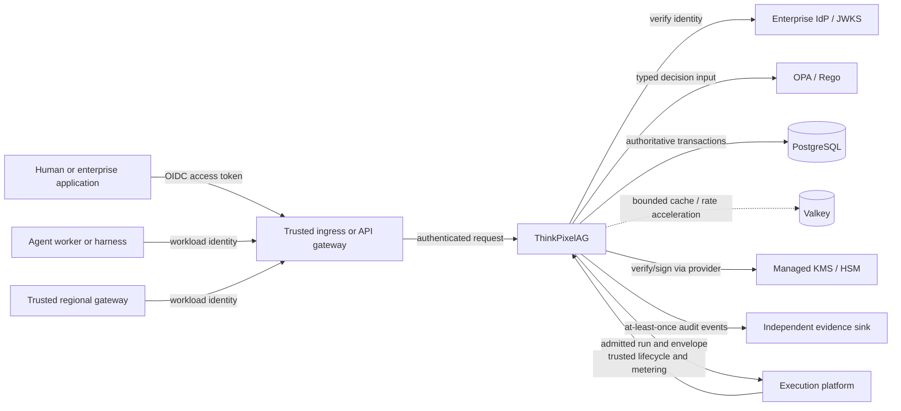
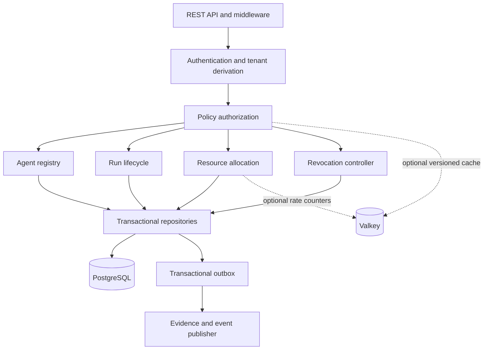
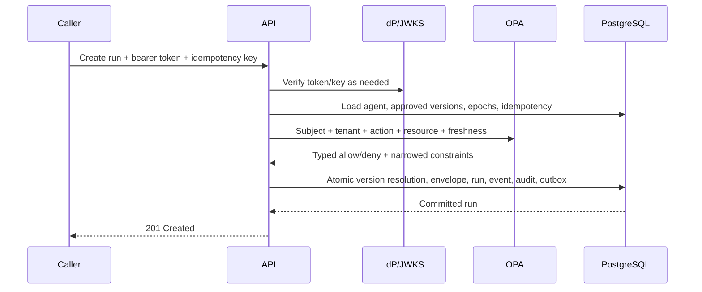

# System Architecture

## Context

ThinkPixelAG is the durable governance plane for enterprise agent execution. It admits and governs runs but does not execute agent logic. Network location is defense in depth, not identity: every caller and workload is authenticated and every protected action is authorized.

## System context

## Internal components

The first deployment is a modular Go monolith. Modules communicate through application interfaces rather than network calls. Background workers are independently enableable so outbox publication and reconciliation can later be deployed separately without changing domain contracts.

## Trust boundaries

| Boundary | Trusted assertion | Required validation | Never trusted directly |
|---|---|---|---|
| Client to ingress/API | Signed bearer identity | issuer, audience, algorithm, signature, time, mapped principal/tenant | body tenant, arbitrary identity headers, raw delegation token |
| Ingress to API | Forwarded context only from configured gateway identity | gateway workload identity plus signed/original token binding | source IP or VPC membership alone |
| Worker to trusted API | Workload identity and run lease/fencing token | service authorization, tenant/run binding, freshness | harness-reported authorization or budget extension |
| API to OPA | Policy artifact identity and typed result | digest/signature/version/freshness and output schema | unversioned or malformed decision |
| API to PostgreSQL | DB service role | TLS where available and least-privilege credentials | database network location alone |
| API to Valkey | Cache service identity | TLS/auth where available, bounded TTL/version key | cache as authoritative ALLOW, epoch, or balance |
| API to KMS | Workload identity and key grant | provider authorization and key/version binding | exported shared signing key |
| API to evidence sink | Sink identity and delivery receipt | authenticated channel, event ID, integrity metadata | application logs as audit evidence |

## Principal data flows

### Run admission

### Meter and settle

Trusted metering events are authenticated, de-duplicated, and appended. A terminal transition settles a child reservation exactly once and returns unused capacity to the parent in the same PostgreSQL transaction. Valkey is never consulted for the authoritative balance.

### Revoke and reconcile

A revocation transaction records the scope, advances applicable epochs, appends an ordered log entry, and writes an outbox event. Streaming push reduces latency. Gateways resume from cursors and periodically reconcile with the authoritative API. Operations fail closed when their maximum security-state age is exceeded.

## Deployment and compromise domains

- Kubernetes supplies scheduling and workload identity, but namespace/network isolation does not replace authentication.
- API, migration job, and background-worker roles use distinct database grants where practical.
- Policy approval, global revocation, emergency resource extension, signing, and evidence administration must not collapse into one standing administrator credential.
- Production signing keys are non-exportable and managed through KMS/HSM.
- The independent evidence sink is administered outside the governance application-admin path.

## Failure posture

| Failure | Protected operation behavior |
|---|---|
| PostgreSQL unavailable | reject mutations; readiness false; no fabricated cached success |
| OPA or valid policy unavailable | deny protected operations; readiness depends on policy freshness |
| Valkey unavailable | bypass cache; use authoritative paths; privileged rate-limited operations fail conservatively if no safe local bound exists |
| IdP/JWKS refresh unavailable | accept only still-valid bounded cached keys; reject unknown keys/new authentication after validity expires |
| Revocation state too stale | fail closed according to operation risk; high-risk writes always require authoritative state |
| Evidence sink unavailable | retain transactional outbox and alert on lag; do not lose the business transaction's evidence record |
| KMS unavailable | reject operations requiring signing; verification may continue with valid bounded cached public material |
