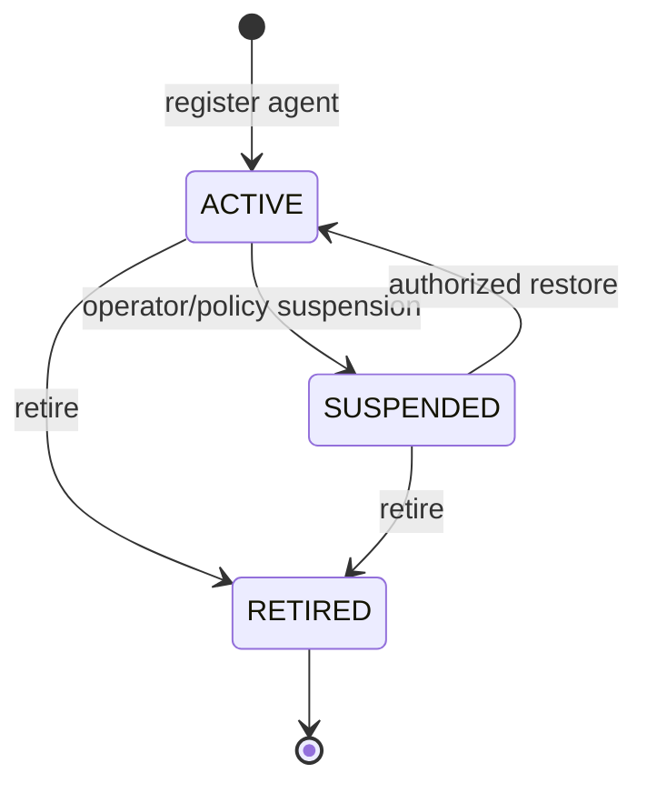
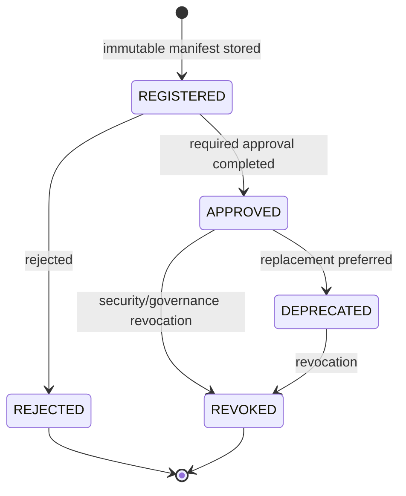
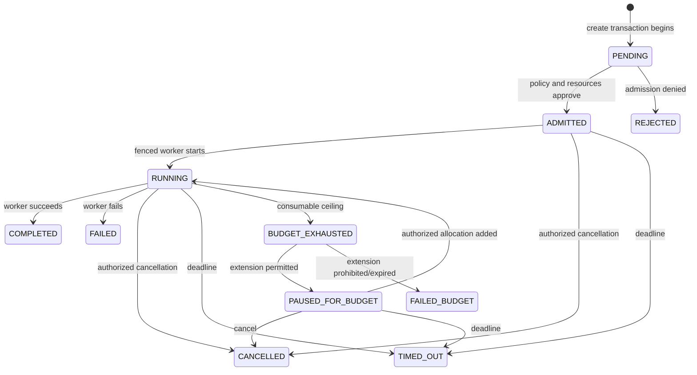

# Domain Contracts and State Machines

## Common rules

- IDs are opaque UUIDv7-compatible strings; clients MUST NOT infer ordering or tenancy from them.
- Timestamps are RFC 3339 UTC with database precision documented by implementation.
- Every tenant-owned record contains immutable `tenant_id`; application repositories scope all reads/writes to it.
- State changes require an authenticated actor, OPA authorization, expected state/version where applicable, an append-only domain event, audit record, and outbox record in the same transaction.
- Duplicate commands with the same valid idempotency scope return the original result. Reuse with a different normalized request hash returns `409 idempotency_key_reused`.
- Illegal transitions return `409 invalid_state_transition`; hidden/cross-tenant resources use enumeration-safe `404` when policy requires it.

## Actors

| Actor | Typical authority |
|---|---|
| Caller | discover/invoke authorized agents; inspect, signal, or cancel owned/authorized runs |
| Worker | claim/start/heartbeat/report terminal state for a leased run; report usage only with trusted-meter role |
| Governor | transition on deadline/budget exhaustion and settle/reconcile resources |
| Operator | register versions, manage approvals/policies/revocations/resources according to role and approval policy |
| System | timeout, lease recovery, outbox/reconciliation actions under a dedicated workload identity |

## Agent lifecycle



- `ACTIVE` agents can be discovered/invoked if policy permits and an eligible version exists.
- `SUSPENDED` prevents new admission; existing-run behavior is a separate policy/revocation decision.
- `RETIRED` is terminal and preserves evidence/history.
- Public discovery first authorizes `agents.list`, then evaluates
  `agents.describe` independently for each active agent's newest approved
  version. Denied or version-ineligible agents are omitted. Detail lookup maps
  absent, cross-tenant, inactive, ineligible, and policy-hidden agents to the
  same `404` response so identifiers cannot be enumerated.
- List continuation uses an authenticated opaque `agent_id` cursor. Policy and
  eligibility are re-evaluated after every continuation; a cursor carries no
  tenant or visibility authority.
- Agent creation requires distinct, active, same-tenant owner and sponsor
  principals and a closed `LOW`, `MEDIUM`, `HIGH`, or `CRITICAL` risk class.
- Name, description, owner, sponsor, risk class, and lifecycle state are mutable
  with optimistic concurrency; identity, tenant, and creation time are not.
  Updates cannot restore a retired agent.

## Agent version lifecycle



The manifest and content digest are immutable after `REGISTERED`. Approval, deprecation, and revocation are append-only state records. New runs normally select `APPROVED`; a `DEPRECATED` version may be selected only by an explicit rollback policy. `REVOKED` is never eligible. Lifting a revocation creates a new governance event and does not erase history or decrement epochs.

Every version decision requires a verified tenant principal and an explicit,
authoritative `versions.approve` policy ALLOW. The allowed transitions are
`REGISTERED -> APPROVED|REJECTED`, `APPROVED -> DEPRECATED|REVOKED`, and
`DEPRECATED -> REVOKED`; rejected and revoked versions are terminal. The
decision is committed with its policy decision ID, actor, request ID, audit
event, and outbox event in one PostgreSQL transaction. Competing decisions lock
the immutable version and exactly one valid transition succeeds.

Automatic resolution considers only currently `APPROVED` versions, newest
first, and selects the first candidate receiving a `runs.create` policy ALLOW.
A caller-supplied digest is never an ordinary selector: an approved historical
version additionally requires a zero-TTL `versions.pin` ALLOW, while a
`DEPRECATED` version requires `versions.rollback`; both still require the
normal invocation ALLOW under the same active policy version. `REGISTERED`,
`REJECTED`, and `REVOKED` versions are never eligible. Admission persists the
chosen version and approval together with the policy digest/version, invocation
decision, optional controlled-selection decision, resolution mode, narrowed
constraints, and timestamp as an immutable per-run snapshot.

Manifest schema version 1 contains exactly `schema_version`, the digest-pinned
`image` reference, sorted unique `models`, `tools`, `skills`, and `subagents`
arrays, and `limits`. Missing or unknown fields are rejected. Model, tool, and
subagent declarations use the bounded API identifier grammar; skill references
are bounded to 1,024 printable non-whitespace characters. Each array contains
at most 100 entries. Limits use integers only, reject negative values, bound
execution time to seven days, and require active children not to exceed total
children.

The content digest is `sha256:` plus the lowercase SHA-256 of compact JSON
produced from that field order after declaration arrays are sorted. The image
digest stored beside the manifest must equal the suffix of the image reference.
Registration compares both digests, stores the version and its normalized
capabilities in one PostgreSQL statement, and exposes no update/delete method.
Database triggers reject direct updates or deletes of either artifact table.

## Run lifecycle



Terminal states are `REJECTED`, `COMPLETED`, `FAILED`, `CANCELLED`, `TIMED_OUT`, and `FAILED_BUDGET`. Terminal states cannot transition. Repeating the same terminal command returns the established state without a second settlement or event. A stale worker fencing token cannot change state.

The pure lifecycle transition boundary uses compare-and-swap semantics: every
command supplies a positive expected state version, and every state change
increments that version exactly once. A stale expected version is rejected
without mutation. The sole exception is an authorized replay targeting the
already-established terminal state, which returns the unchanged state and
version even when the caller retained an older version. Transition timestamps
are authoritative UTC values, never move backwards, and equal `terminal_at`
when a terminal state is first established. Admission transitions are initiated
by the system actor after the application use case has completed its identity,
policy, version, freshness, and resource checks.

| From | To | Allowed initiator | Required conditions |
|---|---|---|---|
| PENDING | ADMITTED | admission use case | identity/policy/version/freshness valid; root/parent resources committed |
| PENDING | REJECTED | admission use case | explicit denial/failure before admission; no open reservation |
| ADMITTED | RUNNING | leased worker | valid unexpired lease and latest fencing token |
| ADMITTED/RUNNING/PAUSED_FOR_BUDGET | CANCELLED | authorized caller/operator/system | current version; settlement exactly once |
| ADMITTED/RUNNING/PAUSED_FOR_BUDGET | TIMED_OUT | governor/system | authoritative deadline reached; settlement exactly once |
| RUNNING | COMPLETED/FAILED | leased worker | valid fencing token; trusted terminal usage accepted; settlement exactly once |
| RUNNING | BUDGET_EXHAUSTED | governor/system | authoritative consumption reaches ceiling |
| BUDGET_EXHAUSTED | PAUSED_FOR_BUDGET | governor | policy permits extension workflow; work remains stopped |
| BUDGET_EXHAUSTED | FAILED_BUDGET | governor/system | no extension permitted or approval window elapsed |
| PAUSED_FOR_BUDGET | RUNNING | governor | additive extension committed and new envelope version issued |

## Worker lease state

A run claim issues a lease ID, expiry, and monotonically increasing fencing token. Heartbeats may extend expiry but never lower the token. Reclaim after expiry increments the token. All worker mutations compare the active lease and fence inside the run transaction.

## Policy activation lifecycle

```text
UPLOADED -> VALIDATED -> APPROVED -> ACTIVE -> SUPERSEDED
    |            |          |
    +----------> REJECTED <-+
```

Only a digest/signature-verified, schema-compatible, tested `APPROVED` artifact can become `ACTIVE`. Activation serializes per policy channel and increments policy version/epoch. Rollback is activation of a previously approved artifact as a new activation event; history and epochs remain monotonic.

## Revocation lifecycle

A revocation is append-only and becomes `ACTIVE` at its effective time. It becomes `EXPIRED` by authoritative time or `LIFTED` through an authorized new change. Creating, expiring, or lifting advances applicable epoch(s); no operation deletes history or decreases an epoch.

## Reservation and settlement lifecycle

```text
PROPOSED -> OPEN -> SETTLED
              |  -> EXPIRED_SETTLED
              +  -> CANCELLED_SETTLED
```

`PROPOSED` exists only within a transaction and is not externally visible. `OPEN` means budget is allocated to a child. All terminal variants are closed exactly once and carry final trusted consumption plus returned unused capacity. See `resource-accounting.md`.
