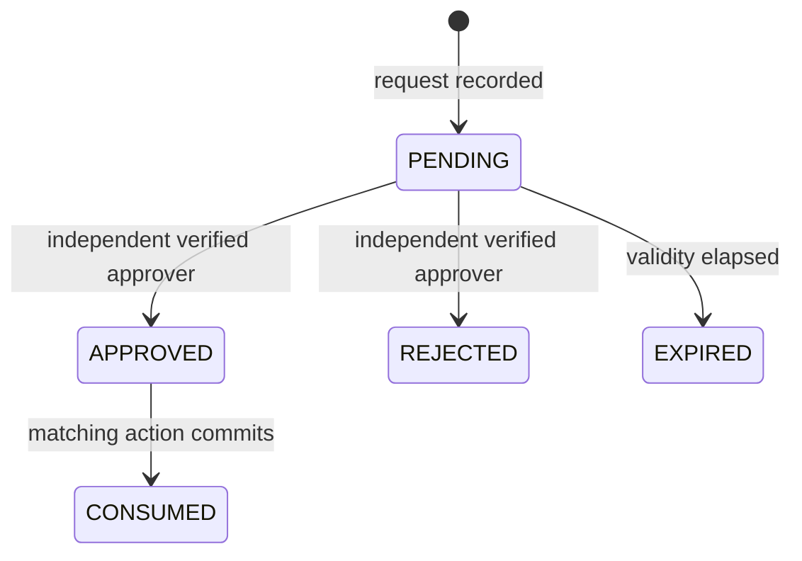

# Governance Approval Contract

## Protected actions

The following closed action classes require four-eyes approval before their
effect can commit: `TRUST_ROOT_ROTATION`, `GLOBAL_REVOCATION_CHANGE`,
`POLICY_BYPASS`, `POLICY_ROLLBACK`, `EMERGENCY_EXPANSION`, and
`PRIVILEGED_AGENT_CLASS`. Unknown classes fail closed. Policy may require the
same control for additional operations, but cannot remove it from these
classes.

## Provider boundary

Approval providers are replaceable adapters. A provider receives only bounded
identifiers, the action class, resource reference, SHA-256 digest of the
normalized proposed action, and expiry. It returns an opaque request reference.
Its signed or authenticated decision assertion MUST bind the approval ID,
provider request reference, action digest, distinct approver principal,
decision, decision time, and an opaque decision reference. Provider outage,
invalid evidence, or any binding mismatch denies progress.

Provider references are evidence pointers, not authority by themselves. The
governance application verifies an assertion through the configured provider
before recording a decision. Raw provider tokens, comments, credentials, and
unbounded request payloads are not stored.

## Four-eyes state

The requester and approver MUST be different tenant principals. A decision at
or after expiry is invalid. Approval is bound to the exact normalized-action
digest and is single-use; consumption is an atomic insert and cannot be
replayed. Rejection, expiry, digest mismatch, prior consumption, or absence of
an approval prevents the protected action.

Requests, decisions, and consumptions are separate append-only records. The
effective state is derived from those records; no update or delete erases
history. Every protected action integration MUST consume the approval in the
same authoritative transaction as the action and its audit/outbox evidence.
SEC-002 supplies this domain, provider, and persistence boundary; the owning
action tickets wire their transactions to it rather than accepting legacy
free-form `approval_reference` values.

Break-glass activation consumes a `POLICY_BYPASS` or
`GLOBAL_REVOCATION_CHANGE` approval in the same transaction as the narrow grant
and its independent evidence. See [the break-glass contract](break-glass.md).
