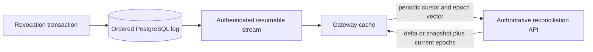

# Revocation, Epoch, and Freshness Contract

## Scopes

The release-candidate model supports `run_id`, `agent_id`, `agent_version`, `skill_digest`, `principal_id`, `tenant_id`, `tool_id`, `policy_version`, and `global`. A revocation includes opaque ID, tenant where scoped, target, controlled reason code plus protected detail reference, actor, effective/expiry times, approval reference when required, and creation/lift status.

## Epochs and ordering

At minimum the deployment maintains:

- a global `security_epoch` for changes affecting all authorization;
- `tenant_policy_epoch` per tenant for tenant/policy changes;
- `agent_revocation_epoch` per tenant/agent for agent/version/capability changes.

An implementation may add scope-specific epochs. Each is a nonnegative, monotonically increasing 64-bit integer protected from overflow. A transaction that creates, lifts, or expires a revocation:

1. locks/increments all applicable epoch rows;
2. writes the immutable revocation change;
3. appends one ordered log record with a database-assigned global sequence and resulting epoch vector;
4. writes audit and outbox records;
5. commits atomically.

An administrative lift is a new change, never deletion, and increments epochs. Log consumers order by sequence, treat duplicate sequence/event IDs idempotently without refreshing the security-state age, and regard a missing sequence outside documented filtering as a gap requiring reconciliation. A consumer preserves its last fully applied state across that gap; later stream events cannot clear it.

## Evaluation

An operation constructs applicable scopes from the verified principal/tenant, requested action/resource, resolved agent version, run, tools/skills, and active policy. It denies when any effective revocation matches or when the assertion/decision epoch is older than the applicable authoritative epoch.

Short-lived assertions contain issuer, subject, tenant, audience, issued/expiry times, unique ID, applicable epoch vector, and capability/constraints. They are rejected on signature, binding, time, revocation, or epoch failure.

## Distribution protocol

The SSE stream is the initial protocol. It provides event ID/sequence, epoch vector, change metadata, and heartbeat. Consumers persist the last fully applied sequence, reconnect with a cursor, and apply only committed events. If retention no longer covers a cursor or a gap is detected, the server signals reconciliation required rather than pretending continuity.

The reconciliation endpoint authenticates/authorizes a gateway, accepts its last sequence and epoch vector, and returns a bounded ordered delta or content-addressed snapshot plus authoritative sequence/epochs. Gateway checkpoints record last applied epoch/sequence, last stream receipt, and last successful reconciliation.

The implemented cursor is HMAC-authenticated and binds tenant, global sequence,
and security epoch. `Last-Event-ID` and `after` resume it; the sequence-only
`after_sequence` parameter exists only for initial compatibility bootstrap.
The service reads at most 256 changes per poll and places a deadline on every
write, so a slow consumer cannot create an unbounded application buffer. The
logical retention window is enforced at every read. Reconciliation returns at
most 10,000 ordered changes; a larger delta or expired cursor switches to a
deterministically ordered SHA-256 snapshot. Checkpoint upserts reject sequence
or epoch regression and derive the gateway identity from the verified token.

## Freshness classes

| Operation class | Default maximum age | Behavior |
|---|---:|---|
| High-risk write | 0 seconds cached ALLOW | live authoritative revocation state and policy decision required |
| Normal write | 30 seconds | deny after last authoritative state exceeds bound |
| Sensitive read | 60 seconds | deny after bound |
| Low-risk read | explicit deployment policy | bounded cache only; never unlimited |

Age is based on monotonic elapsed time since a successful authoritative observation, not wall-clock subtraction alone. Configuration may tighten defaults. Loosening requires policy/approval and cannot weaken the high-risk-write invariant.

The application classifies the action before consulting a decision cache.
`agents.list` is low-risk; agent descriptions and run/event reads are
sensitive; run signal/cancel and low/medium-risk admission or worker lifecycle
are normal writes. High/critical-risk admission or worker lifecycle, resource
metering/settlement/extension, governance changes, and every unknown action are
high-risk writes. Unknown actions deliberately take the live path so a newly
introduced mutation cannot silently inherit cacheable behavior.

Caller-provided security-state fields are never trusted. For bounded classes,
the application replaces them with the tenant tracker snapshot, rounds
monotonic age upward to whole seconds, and denies before policy evaluation when
state is unknown, the monotonic clock is unhealthy, or the class bound has
expired. High-risk writes instead mark evaluation authoritative; the cache
bypasses reads and writes, the revocation authority is queried live, and an
ALLOW with nonzero TTL is rejected as an invalid security result.

Each process keeps tenant-scoped freshness state in memory: the last fully
applied sequence and epoch vector, last stream receipt, last successful
reconciliation, and age since the newer authoritative observation. UTC receipt
timestamps are diagnostic only. The age uses a process-lifetime monotonic clock,
so wall-clock correction cannot make stale state appear newer. A process restart
begins without authoritative state, and a sequence, epoch, or monotonic-clock
regression fails closed rather than refreshing the observation.

## Cache rules

- Cache keys include policy version, relevant epoch vector, subject, tenant, action, resource, normalized input digest, and contract version.
- Effective TTL is the minimum of policy-returned TTL, token expiry, policy artifact validity, operation-specific revocation freshness remaining, and deployment maximum. The operation bound and all applicable epoch dimensions are cache-key inputs.
- Push events invalidate matching keys or make them unreachable through epoch-versioned keys.
- Accepted stream and reconciliation observations synchronously clear the
  tenant's bounded instance-local decisions and advance the generation included
  in hashed Valkey keys. Policy activation and rollback use the same hook.
- Valkey/local cache loss is safe; it cannot generate a new ALLOW.
- A denied result may be cached only within policy and incident-response constraints; global epoch changes invalidate both outcomes.

## Service health

Each instance exposes last applied sequence/epochs, last stream receipt, last authoritative reconciliation, calculated age, gap state, and outcomes as metrics without tenant IDs as unbounded labels. Readiness is false when the instance cannot satisfy the configured minimum operation class it is meant to serve. Liveness is not tied to a transient upstream partition.

The implemented process aggregates tenant state into
`thinkpixelag_revocation_age_seconds`, `thinkpixelag_revocation_lag_entries`,
`thinkpixelag_revocation_gaps`, `thinkpixelag_revocation_gap_events_total`,
`thinkpixelag_revocation_tracked_tenants`, and
`thinkpixelag_revocation_fresh`. Age and lag are the maxima across tracked
tenants; gap and tenant gauges are counts, so tenant identifiers never become
metric labels. Scrape-time age continues advancing during a partition.

A tenant enters the readiness contract when the freshness-enforcing boundary
first sees it (or process assembly registers it explicitly). It begins unknown
after every process start. Readiness fails when any tracked tenant has no
authoritative observation, an unhealthy monotonic clock, age beyond the
configured minimum serving-class bound, a known authority head beyond its last
applied sequence, or an unresolved gap. Successful reconciliation clears a gap
only after applying its authoritative sequence and epochs. The HTTP readiness
composition retains database/startup/drain ownership while adding this security
probe; liveness deliberately does not compose it.

The same lag and gap conditions fail closed at the bounded authorization
boundary, so an instance cannot continue serving from an otherwise unexpired
local ALLOW while it knows it is incomplete. Only a successful authoritative
reconciliation applies the complete sequence/epoch state, clears the gap, and
restores bounded serving. Cache expiry and epoch/generation changes ensure an
ALLOW from before recovery cannot reappear transiently afterward.

## Gateway integration

The gateway persists its last fully applied cursor and epoch vector atomically
with its local revocation view. The service-side checkpoint is operational
evidence of delivery or reconciliation and regression protection; it is not a
substitute for the gateway's durable apply boundary. On restart the gateway is
unknown until it observes current authority, even when it can load a checkpoint.

Consumers apply only contiguous events, replay exact duplicates without
refreshing security age, and reconcile on a `410 Gone`, terminal `gap` event,
decode failure, or locally detected discontinuity. A reconciliation delta is
applied in order; a snapshot replaces the active local view after its digest,
authoritative sequence, and epochs are accepted. Only that complete apply may
clear a gap and restore bounded serving. Disconnects do not reset age: the
gateway may serve only within the applicable monotonic freshness window, while
high-risk writes continue to require live authority.

The Phase 6 single-connected-gateway measurement includes database commit,
polling, SSE encoding/delivery, and client decoding. Production fanout to the
capacity target, reconnect storms, and cross-zone behavior remain Phase 8 load
qualification. Results and the complete consumer sequence are recorded in
`docs/phase-6-evidence.md`.

## Required scenarios

Tests cover concurrent increments, global/tenant/run/agent/tool/skill/policy revocation, lift/expiry, duplicate and out-of-order delivery, dropped sequence, retention gap, stream reconnect, process restart, clock adjustment, cache expiry, partition beyond each freshness bound, snapshot reconciliation, and recovery without transient stale ALLOW.
