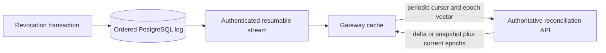

# Revocation, Epoch, and Freshness Contract

## Scopes

The release-candidate model supports `run_id`, `agent_id`, `agent_version`, `skill_digest`, `principal_id`, `tenant_id`, `tool_id`, `policy_version`, and `global`. A revocation includes opaque ID, tenant where scoped, target, controlled reason code plus protected detail reference, actor, effective/expiry times, approval reference when required, and creation/lift status.

## Epochs and ordering

At minimum the deployment maintains:

- a global `security_epoch` for changes affecting all authorization;
- `tenant_policy_epoch` per tenant for tenant/policy changes;
- `agent_revocation_epoch` per tenant/agent for agent/version/capability changes.

An implementation may add scope-specific epochs. Each is a nonnegative, monotonically increasing 64-bit integer protected from overflow. A transaction that creates, lifts, or expires a revocation:

1. locks/increments all applicable epoch rows;
2. writes the immutable revocation change;
3. appends one ordered log record with a database-assigned global sequence and resulting epoch vector;
4. writes audit and outbox records;
5. commits atomically.

An administrative lift is a new change, never deletion, and increments epochs. Log consumers order by sequence, treat duplicate sequence/event IDs idempotently, and regard a missing sequence outside documented filtering as a gap requiring reconciliation.

## Evaluation

An operation constructs applicable scopes from the verified principal/tenant, requested action/resource, resolved agent version, run, tools/skills, and active policy. It denies when any effective revocation matches or when the assertion/decision epoch is older than the applicable authoritative epoch.

Short-lived assertions contain issuer, subject, tenant, audience, issued/expiry times, unique ID, applicable epoch vector, and capability/constraints. They are rejected on signature, binding, time, revocation, or epoch failure.

## Distribution protocol

The SSE stream is the initial protocol. It provides event ID/sequence, epoch vector, change metadata, and heartbeat. Consumers persist the last fully applied sequence, reconnect with a cursor, and apply only committed events. If retention no longer covers a cursor or a gap is detected, the server signals reconciliation required rather than pretending continuity.

The reconciliation endpoint authenticates/authorizes a gateway, accepts its last sequence and epoch vector, and returns a bounded ordered delta or content-addressed snapshot plus authoritative sequence/epochs. Gateway checkpoints record last applied epoch/sequence, last stream receipt, and last successful reconciliation.

## Freshness classes

| Operation class | Default maximum age | Behavior |
|---|---:|---|
| High-risk write | 0 seconds cached ALLOW | live authoritative revocation state and policy decision required |
| Normal write | 30 seconds | deny after last authoritative state exceeds bound |
| Sensitive read | 60 seconds | deny after bound |
| Low-risk read | explicit deployment policy | bounded cache only; never unlimited |

Age is based on monotonic elapsed time since a successful authoritative observation, not wall-clock subtraction alone. Configuration may tighten defaults. Loosening requires policy/approval and cannot weaken the high-risk-write invariant.

## Cache rules

- Cache keys include policy version, relevant epoch vector, subject, tenant, action, resource, normalized input digest, and contract version.
- Effective TTL is the minimum of policy-returned TTL, token expiry, policy artifact validity, revocation freshness remaining, and deployment maximum.
- Push events invalidate matching keys or make them unreachable through epoch-versioned keys.
- Valkey/local cache loss is safe; it cannot generate a new ALLOW.
- A denied result may be cached only within policy and incident-response constraints; global epoch changes invalidate both outcomes.

## Service health

Each instance exposes last applied sequence/epochs, last stream receipt, last authoritative reconciliation, calculated age, gap state, and outcomes as metrics without tenant IDs as unbounded labels. Readiness is false when the instance cannot satisfy the configured minimum operation class it is meant to serve. Liveness is not tied to a transient upstream partition.

## Required scenarios

Tests cover concurrent increments, global/tenant/run/agent/tool/skill/policy revocation, lift/expiry, duplicate and out-of-order delivery, dropped sequence, retention gap, stream reconnect, process restart, clock adjustment, cache expiry, partition beyond each freshness bound, snapshot reconciliation, and recovery without transient stale ALLOW.
